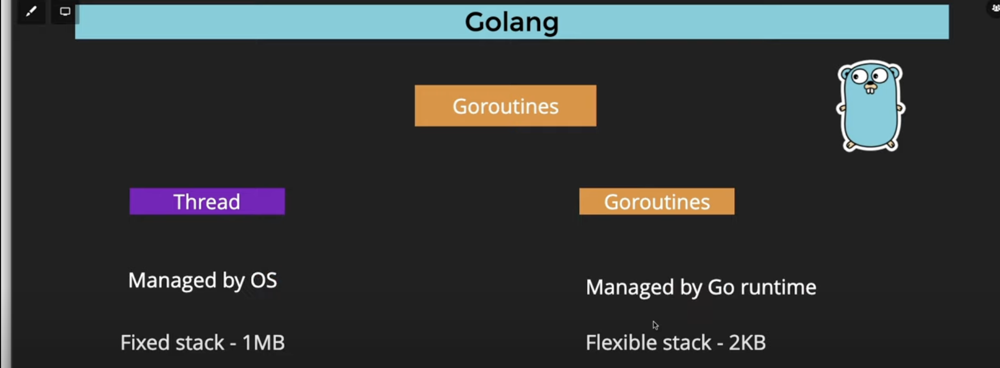

# Concurrency
Concurrency in Go, in simple words, means that you can have different parts of your computer program working on different tasks at the same time, a bit like having multiple workers in a kitchen. Each worker (or "goroutine" in Go) can perform its job independently and doesn't have to wait for others to finish. This helps make programs in Go run efficiently and use your computer's resources effectively, just like a well-organized kitchen with multiple cooks getting things done simultaneously.

### Key Points
* So concurrency simple means When I am allowing myself to involve in multiple tasks but I am not doing them at the same time.

Difference Between Concurrency and Parallelism:

| Aspect              | Concurrency                         | Parallelism                         |
|---------------------|------------------------------------|------------------------------------|
| Definition          | Managing multiple tasks concurrently, where tasks may not run simultaneously but appear to overlap in time. | Executing multiple tasks at the exact same time, making use of multiple processors or cores. |
| Example             | Workers multitasking in a kitchen - each worker switches between tasks, but not all tasks happen at the exact same time. | Multiple workers in a kitchen, where each worker handles a different task simultaneously. |
| Resource Usage      | Can be more efficient in terms of resource utilization, especially for I/O-bound tasks where one task can yield while waiting for I/O operations. | Requires multiple processing units (e.g., CPU cores) and is more efficient for CPU-bound tasks that can be truly parallelized. |
| Typical Use Case   | Well-suited for handling many tasks that may involve waiting or interacting with external resources, like handling network requests or file operations. | Effective for computationally intensive tasks that can be divided into smaller, independent parts that can run concurrently without dependencies. |
| Coordination       | May require synchronization mechanisms like mutexes or channels to coordinate and share data between concurrent tasks. | Parallel tasks often don't need as much coordination since they work independently on different data. |
| Example Language   | Go (Goroutines), Python (Threading), Java (Threads) | Go (Goroutines with parallelism), C++ (std::thread), and other languages with parallel programming support. |

In summary, concurrency is about managing tasks effectively, allowing them to overlap in time and efficiently utilize resources, while parallelism focuses on executing tasks simultaneously, typically requiring multiple processing units. The choice between them depends on the nature of the tasks and the available hardware.

### Go Routine
A Goroutine in Go is like a tiny, lightweight thread that helps your Go program do multiple things at once. It's a way to run functions concurrently, almost like having multiple workers in your program. These Goroutines can work independently and don't require a lot of memory, making your program efficient and capable of handling many tasks simultaneously without slowing down.

* Go routine ki help se ham uss particular task ko alag thread pr daaldete hai and Jo hamara main thread hota hai uske khtm hone se phele hame jo alag thread pr dala hai task vo complete hona compulsory hai and also If we dont do this then after the execution of main thread alag we can use that thread or execute nahi kr payenge.

### Mutex
A Mutex in Go, in simple terms, is like a key to a shared room. When multiple Goroutines (concurrent threads) want to access or change something that they could mess up if they all did it at once, they have to ask for the Mutex. Only one Goroutine with the Mutex key can enter the room at a time, ensuring that they take turns and don't interfere with each other, preventing conflicts and errors in your program.

* Multiple Go Routines can share resource for reading purpose.

* So Let's say I have multiple thread and they want to write something in the same variable at a same time so In that case we use mutex to optimize this as we allow one thread to write at one time using lock() and unlock().

### Channels
Channels in Go, in simple words, are like communication pipes that allow Goroutines (concurrent threads) to talk to each other and share data safely.

Imagine you have two workers in a kitchen – one is chopping vegetables, and the other is cooking. They need to coordinate. A channel would be like a special tray they use to exchange instructions and ingredients. The worker chopping vegetables puts the chopped veggies on the tray, and the cooking worker takes them from the tray to use. This way, they can work together without messing up each other's tasks.

In Go, channels serve a similar purpose. One Goroutine can send data on a channel, and another Goroutine can receive that data. It ensures that data is passed between Goroutines in a synchronized and organized manner, preventing conflicts and making concurrent programming safer and more predictable.

Channels are a typed conduit through which you can send and receive values with the channel operator, <-.

ch <- v    // Send v to channel ch.
v := <-ch  // Receive from ch, and
           // assign value to v.
(The data flows in the direction of the arrow.)

Like maps and slices, channels must be created before use:

ch := make(chan int)
By default, sends and receives block until the other side is ready. This allows goroutines to synchronize without explicit locks or condition variables.

The example code sums the numbers in a slice, distributing the work between two goroutines. Once both goroutines have completed their computation, it calculates the final result.